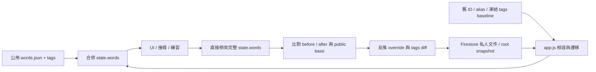
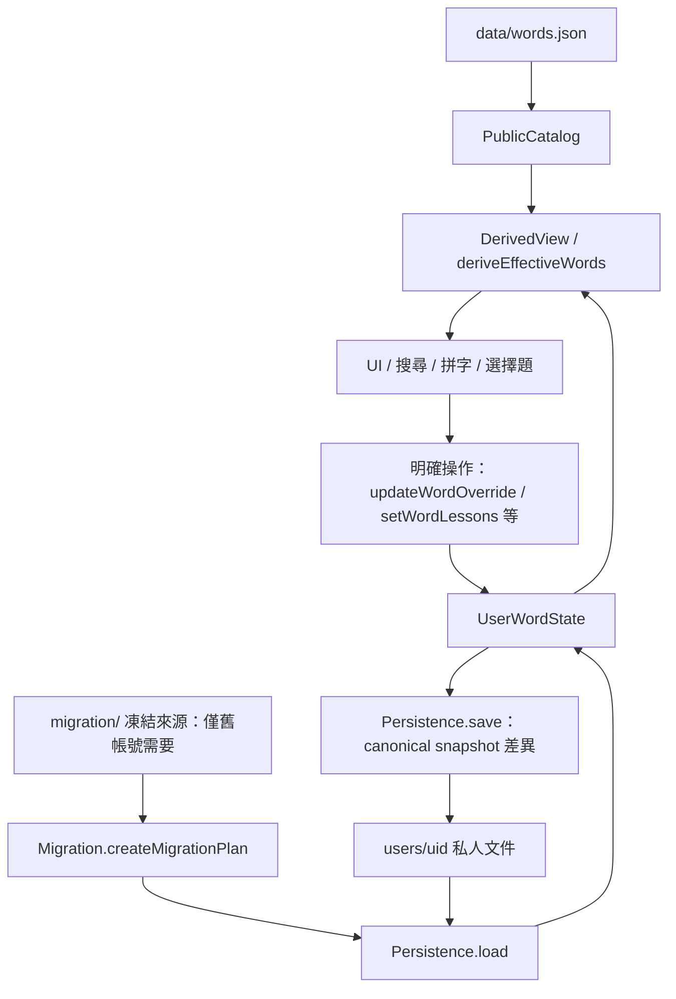

# 單字王資料架構：schema 6

本文件描述這次重構後的程式與 migration 協定。正式網站由 GitHub Pages 的 `main:/` 發布（https://stu310101-arch.github.io/wordking/），Firebase project 為 `wordking-434f7`。個人資料操作的驗證使用隔離 fixture 與 Emulator；發布不會批次改寫正式帳號，舊帳號在下一次登入時依照下述協定遷移。

## 改動前的資料流



原本的 public + per-user override 方向保留。此次移除的是合併單字作為唯一寫入模型、runtime `tags` / `folderId` / `defaultId` 相容別名、UI 中的舊 ID 解析與 Firestore 文件組裝，以及從 meaning 猜詞性的練習邏輯。

## 新資料流與檔案邊界



| 邊界 | 實作 | 責任 |
| --- | --- | --- |
| PublicCatalog | `assets/word-data.js`、`data/words.json` | 驗證唯一英文與 opaque ID、提供不共享可變引用的公用基底 |
| UserWordState | `assets/word-data.js` | 每個帳號一個 instance，直接操作 sparse overrides、custom words、hidden IDs、folders、settings |
| Migration | `assets/migration.js`、`migration/` | 集中解讀所有 legacy 欄位、ID 與凍結基準；pure planner 無 I/O |
| Persistence | `assets/persistence.js` | 唯一知道 collection 路徑、讀寫、revision、lease、journal、backup 的邊界 |
| DerivedView | `deriveEffectiveWords()`、`app.js` 的 `refreshDerivedView()` | 產生完整單字、資料夾檢視鍵與顯示名稱 |
| UI | `assets/app.js`、`index.html` | 使用模型 API；維持原有頁面、搜尋、練習及 Google Auth 流程 |
| 檢查 | `config/validate-words.cjs`、`tests/` | 靜態資料、凍結檔案、隔離、遷移失敗點、同步及 rules 驗證 |

三個資料模組都可以直接被 Node 測試載入，無須 Firebase 或 DOM。Persistence 使用 Migration 匯出的純 canonical snapshot validator；只有缺少 v6 完成標記且存在舊資料時才執行 legacy planner 或下載歷史 JSON。

`state.words` 與 `state.hiddenWords` 僅是 derived view。`commitUserMutation(model => …)` 保存模型 snapshot 供交易差異與錯誤 rollback 使用，不從完整公用單字反推 override。Firestore collection 名稱與 legacy mapping 不出現在 UI 操作程式。

## Canonical word

公用庫現在有 **452 筆唯一英文、478 個課程歸屬**。同一英文的大小寫變體視為同一 entity；`english.trim().toLowerCase()` 重複會被驗證拒絕。修改英文、中文或課程都不改 ID。

```json
{
  "id": "w_000001",
  "english": "penetrate",
  "meanings": [
    { "partOfSpeech": "verb", "definitions": ["穿透", "滲透"] }
  ],
  "lessonIds": ["晟景Lv5U6"]
}
```

公用 JSON 不含 `source`、`tags`、`folderId`、`folderIds` 或 `defaultId`。公用資料的 `isWrong` 為 false，省略時模型同樣提供預設 false。有效單字的 `source: public/custom` 只在 view 存在。

採用 `meanings: {partOfSpeech, definitions: string[]}[]`：一筆單字內每個詞性一組，各自持有中文意思陣列。canonical word 不含獨立的 `meaning` 或頂層 `partOfSpeech`。每個詞性只能出現一次，定義保留順序、去除前後空白和重複值；詞性組依固定 enum 排序。空 meanings、空 definitions 都是有效的明確個人值。

卡片背面顯示英文，再依序顯示「名詞：…」「動詞：…」等分組；搜尋、拼字提示、選擇題及作答紀錄都從相同結構讀取。編輯視窗可增加／移除詞性組，每組有自己的中文輸入框；輸入以分號或換行分開的意思，儲存成 definitions 陣列。UI 不再解析 `(v.)` 或把一份中文自動套到所有詞性。原始教材中的不同詞性定義依歷史標註轉換，一般解釋括號保留。使用者舉例不會造成公用字庫新增單字。

「加入課程與個人資料夾」區域可直接輸入私人資料夾名稱並按「新增並勾選資料夾」，可連續新增多個。新資料夾立即出現在選單並勾選；既有課程選擇、待複習與中文草稿保留。按儲存才把資料夾與單字放進同一次個人交易；取消不會建立資料夾，儲存失敗則一起回復。課程與私人資料夾仍使用不同 identity。

詞性可用：noun、verb、adjective、adverb、pronoun、preposition、conjunction、interjection、other、determiner、article、numeral、auxiliary、phrase。

### ID 配發與歷史保留

- 已一次性配發 `w_000001` 至 `w_000429`；初次配發基準及 SHA-256 都已凍結，不能從目前英文、課程或排序重新產生。
- 446 個歷史 ID（含 17 個課程 alias）各保留 encoded / decoded 形式，共 **892 個 mapping keys**。
- 新公用字配發下一個未用過的 ID，第一次之後永遠保留；不要回收 ID 或以另一個字覆蓋舊 identity。初始下一號為 `w_000430`，後續請根據完整 Git 配發歷史選號，不能反覆使用凍結檔的初始下一號。
- 發布後的公用字應保留 identity；驗證器禁止刪除初始 429 個映射目標。需要更正英文時改原筆。
- custom word / folder 的 UI 新增使用 `c_` / `f_` + UUID；名稱更改不影響 ID。舊 custom / folder ID 可保留；公用 `w_` namespace 不給 custom 使用。

### 課程名稱與 2026-09-08 匯入

`assets/word-data.js` 的小型 `PUBLIC_LESSONS` 登記表將課程 ID 與顯示名稱分開，也可在匯入單字前建立空課程。`getPublicLessonIds()` 合併已登記課程與字庫中實際的課程；`getPublicLessonName()` 提供公用名稱。UI 統一經由 `getFolderDisplayName()` 顯示，個人的 `settings.lessonFolderNames` 仍優先。不增加正常載入所需的 HTTP 請求。

- 原「死神單字Lv5 a」改名為「死神單字Lv5U1」，保留原有 40 個單字、word IDs 與課程 ID `死神單字Lv5 a`。這個 ID 是原課程的永久識別，不是新舊欄位 alias；既存 `addedLessonIds`、`removedLessonIds`、`hiddenLessonIds`、個人改名與 custom word 歸屬因此不需改寫或 migration。同名私人資料夾也不會被更名。
- 先登記「死神單字Lv5U2」，再依「整理單字陣列」對話（`6a9fd9bd-0e48-83ee-b050-d92c50781145`）匯入 32 個單字：23 筆新字配發 `w_000430` 至 `w_000452`；9 筆既有字沿用原 ID，加入 U2 並保留原課程。`batch` 的名詞補「一組」，原動詞「分批」保留。沒有改動其他既有中文或凍結 migration 檔。
- 這次的 `auction` 是來源清單中的正式匯入資料；先前只拿它示範畫面時並未新增。接下來的新 ID 必須從未使用的 `w_000453` 起配發，仍不得改寫初始凍結配置。

## 個人 Firestore schema

所有 client 私人資料都位於 `users/{uid}`，不建立可寫公用 Firestore catalog。實際公用內容隨網站 Git 發布；登入者無法透過 Firestore 寫入 `data/words.json`。

| 路徑 | 內容 |
| --- | --- |
| `users/{uid}` | `schemaVersion: 6`、`revision`、`syncFence`、暫時的 `syncLock`、`migrationV6`，保留原 root snapshot 及既存 `migrationV5` |
| `wordOverrides/{publicWordId}` | 只存個人欄位與課程增減、私人 `folderIds` |
| `customWords/{customWordId}` | 完整私人內容，不含 `id`、`source`、public base |
| `hiddenWords/{publicWordId}` | 文件存在即隱藏；僅 schema 與更新時間 metadata |
| `folders/{folderId}` | `{name, schemaVersion, updatedAt}` |
| `settings/main` | 個人設定，含 `hiddenLessonIds`、課程顯示名稱及音效 |
| `migrationBackups/{runId}` | migration / 大量寫入 journal 的狀態、cursor、批次數及備份段數 |
| `migrationBackups/{runId}/entries/{n}` | 分段 JSON 原始私人來源與衝突報告 |
| `migrationBackups/{runId}/chunks/{n}` | 可重複接續的 canonical 文件操作 |

一般 canonical 文件由 Persistence 加入 `schemaVersion: 6`、ISO `updatedAt`。時間僅供診斷；衝突判定使用 Firestore transaction、revision 與 fence，不依賴各裝置時鐘排序。

```json
{
  "meanings": [{ "partOfSpeech": "verb", "definitions": ["我的解釋"] }],
  "addedLessonIds": ["晟景Lv5U8"],
  "removedLessonIds": ["晟景Lv5U6"],
  "folderIds": ["f_個人資料夾ID"],
  "isWrong": true,
  "schemaVersion": 6,
  "updatedAt": "2026-09-06T00:00:00.000Z"
}
```

`lessonIds` 是教材／課程 identity。`folderIds` 是私人 folder document ID，顯示名稱可重複，也可以和某課程同名。view 使用 `lesson:<id>` / `folder:<id>` 區分，不把這些 view keys 存進 canonical word。使用者自訂的新資料夾歸入 folder，不會偷偷建立公用課程。

課程計算：`(public.lessonIds ∪ addedLessonIds) − removedLessonIds`。曾移除、目前暫不在公用庫的課程 ID 仍保留於 diff；未來公用庫重新加入時維持使用者意圖。私人 folder membership 獨立計算。

未修改欄位繼承最新公用值。明確的空 meanings、空 definitions 或 `false` 都有效。`meanings` 是整個分組陣列的 override：修改一組時保存此字的個人分組，不另外建立 POS entity。尚未修改 meanings 的帳號繼承後續公用分組更新；已修改者保留個人分組。使用者明確設回公用值時刪除該 override 欄位；最後一個差異消失就刪掉文件。若公用更新剛好追上既存個人值，不在一般載入時推定使用者放棄個人意圖。

custom word 存完整 `english`、`meanings`、`lessonIds`、`folderIds`、`isWrong`。新增與更名都拒絕和有效公用字、隱藏公用字或其他 custom word 產生相同英文。

## 資料 API 與恢復行為

```js
const account = WordKingData.createUserWordState(publicCatalog, snapshot);
account.getPublicWord(id);
account.getWordOverride(id);
account.getEffectiveWord(id); // 預設可供隱藏字的編輯／恢復使用
account.deriveEffectiveWords(); // 預設排除隱藏字
account.updateWordOverride(id, { meanings: [{ partOfSpeech: 'verb', definitions: ['新的個人解釋'] }] });
account.clearWordOverrideField(id, 'meanings');
account.clearWordOverride(id);
account.setWordLessons(id, ['晟景Lv5U8']);
account.setWordFolders(id, ['f_example']);
account.hidePublicWord(id);
account.restorePublicWord(id);
account.createCustomWord('c_example', { english: 'example', meanings: [{ partOfSpeech: 'noun', definitions: ['例子'] }] });
account.updateCustomWord('c_example', { meanings: [{ partOfSpeech: 'noun', definitions: ['我的例子'] }] });
account.deleteCustomWord('c_example');
account.setFolder('f_example', { name: '考前複習' });
account.exportState();
```

- 「恢復公用各詞性中文意思」清除整個 meanings override；課程、資料夾及錯題狀態保留。
- 「恢復此字全部公用內容」清除整筆 override（含私人資料夾 membership），重新繼承公用值。
- 隱藏與恢復隱藏只操作 hidden ID；恢復後仍有原個人 override。
- 刪 custom word 只刪本人的 custom document。
- 重置帳號清除現行私人 overrides、custom words、hidden words、folders 與設定差異；保留 migration 完成標记及 recovery backup，避免舊 root / alias 復活。
- 如果公用英文更新日後與已存在的個人更名／custom word 衝突，模型會拒絕套入該組資料，保存原始資料供處理，不自行刪字或靜默改名。公用解釋、POS、課程的正常更新不受此限制。

## 保守 migration 協定

### 來源與轉換

`migration/` 保留原始 `legacy-catalog.json`、`legacy-word-id-aliases.json`、`legacy-lessons/`；固定 `legacy-word-id-map.json`、`legacy-tag-baseline.json` 與 `frozen-sources.json`。原有 14 個凍結來源檔以 SHA-256 驗證。schema 6 另新增 `schema-v5-catalog.json` 及獨立 SHA-256，原樣保留 schema 5 的 429 筆平面中文與 POS，供辨識舊 override 基準。沒有刪除 recovery 內容，也沒有重新配發 identity。

`.gitattributes` 禁止 Git 對 `migration/**` 自動轉換換行，確保 Windows、Linux 與 GitHub checkout 的 recovery checksum 一致。

GitHub Pages 透過根目錄 `_config.yml` 的 `exclude` 排除 `config/`、`tests/`、架構文件、Tailwind 輸入檔及不供 runtime 讀取的 `legacy-lessons/`、舊 alias 快照與 checksum 清單。這些檔案保留在 Git 供測試、維護與復原使用，不作為網站資產發布。`.gitignore` 排除本機預覽建置輸出及 Firebase CLI 診斷紀錄。

`legacy-word-id-map.json`、`legacy-tag-baseline.json`、`legacy-catalog.json`、`schema-v5-catalog.json` 仍必須發布在 `migration/`，由 `assets/persistence.js` 在需要遷移時載入。不能因為新帳號平常不載入它們而撤下；尚未登入的舊帳號仍可能需要這四份資料。舊的 `data/lessons/` 與 `data/word-id-aliases.json` 路徑已移出 runtime。

正常訪客只下載 `data/words.json`。已完成 v6 的帳號只讀私人 canonical collections / settings 及同步 metadata，不下載任何歷史 JSON，也不讀 `deletedDefaults`。新空帳號只寫完成標記，不複製公用字庫，也不載入歷史檔。

舊帳號缺少 v6 完成標記時，讀取 root、wordOverrides、customWords、deletedDefaults、hiddenWords、folders、settings。planner 使用固定舊基準，不拿今天的解釋／課程當成「當時使用者沒有修改」的證據。

已完成 v5 的帳號只轉換 schema 5 文件，不重新匯入保留的 pre-v5 root、alias、deletedDefaults、custom、folder 或 settings。即使 v6 staging 失敗、root 已是 6/preparing，仍透過保留的 v5 完成標記維持這個範圍。未完成的 v5 ready/applying journal 先按 protocol 5 接續完成，再升級 v6；兩份 journal 及原始 backup 均保留。

舊中文中的末尾詞性註記（包含連續 `(v.)(n.)`）歸入各自的詞性組。v5 平面 meaning/POS 與凍結公用基準相符時，可從原始教材還原不同詞性的中文。若是使用者自訂的平面多詞性內容，歷史資料沒有逐詞性對應資訊：保守地讓各個已標註詞性保留完整中文，列出 `flat-v5-meaning-grouping-preserved` 報告，並保留原文備份供本人修訂。沒有 POS 資訊時使用 `other`，不猜測中文詞性。

1. 文件路徑 ID 優先於 payload 的 `id`。所有已知舊 ID / alias 轉成固定 opaque ID；encoded / decoded alias 的權威重設判定一致。
2. 最早無 ID 的 root words 只可依凍結的舊 English 找 identity；找不到但有完整英文的資料保留為 deterministic custom word。
3. root 若已有 `migratedToDiffStorageAt`，不再匯入其保留快照，避免覆蓋後來修改或復活已刪資料。
4. 舊 `folderIds` / `folderId` / `tags` 的完整集合用凍結 baseline 判定課程增減。舊 runtime 同時攜帶的 `lessonIds` 不凌駕完整 memberships；只有獨立 `lessonIds` 輸入才當成課程集合。custom 的明確 lessonIds 與拆分結果合併。
5. schema 2 的 `addedTags` / `removedTags` 拆成課程 diff 與私人 folder。未知分類保留為私人 folder；同名課程與已知私人 folder 同時保留並記錄歧義。
6. 舊 alias 的 scalar 衝突依來源優先級與歷史 timestamp 決定有效值，原值全留備份；新版 authoritative reset 可壓過陳舊 alias。舊隱藏 true / false 衝突採可見值，v5 hidden document 存在則優先隱藏。
7. 相同英文的 custom / public 或 custom / custom 合併中文、詞性、歸屬及錯題，不建立第二 entity。相互衝突的公用更名保留在 recovery，其他個人欄位照常遷移。未知 sparse override、無法解析的資料與所有未知欄位都留在原始備份並列入報告。
8. 整體結果通過真正的 UserWordState 驗證後才允許開始寫入；未支援的未來 schema 或不合法模型在寫入前失敗。

完整 memberships 中缺少某舊課程，無法百分之百分辨是當時同步殘缺還是本人移除。這是歷史資料的資訊限制。採凍結 baseline 的既有語意，保留全部來源讓使用者可復原，不使用今天公用課程倒推意圖。

### 寫入與失敗重試

1. 同一帳號取得 root revision 與 lease，租期 120 秒，每批延長；`fence` 單調增加。新的 migration 此時升為 schema 6 / preparing，rules 開始拒絕舊協定寫入。
2. 先將所有私人原始來源、未知欄位及 conflicts 序列化備份，再寫 frozen operation chunks，最後才標記 journal ready / migration applying。
3. 每批最多 180 個操作，序列化約 600 KB 上限。每個 transaction 先讀 root、journal、chunk，完成全部 reads 才 writes；原子更新 cursor 與資料。單一過大資料會停止，原始來源不刪除。
4. 最後 transaction 才將 `migrationV6.status` 設 complete、revision +1、記錄 `lastOperationId` 並移除 lease。接續舊 journal 時使用其原本的版本標記。reader 不顯示 applying 期間的半套資料。
5. 中斷時保留 journal。lease 過期後重試接續同一 frozen plan 的 cursor；舊 worker 的 fence 不符便不能繼續寫。ready 前失敗尚未碰 canonical 文件，可重建計畫。最後提交成功但回應遺失也不會重複匯入。
6. 同一筆 custom / override / folder / settings 需要換格式時，只有完整備份 ready 後才覆寫；root 原始陣列、舊 alias / deletedDefaults 文件不提前刪除。v6 loader 只讀 schema 6 文件，不把保留的舊文件當成現行資料。

一般小筆修改用單一 revision-guarded transaction；大量刪除／重置使用相同 journal 流程。Firestore 交易 callback 可能重試，因此 callback 只進行可重入的資料操作。設計依據：[Firestore transactions](https://firebase.google.com/docs/firestore/manage-data/transactions)、[Firestore quotas](https://firebase.google.com/docs/firestore/quotas)。

### 復原與清理

設定中的「下載我的遷移備份」呼叫 owner-scoped `Persistence.exportRecovery()`，將原始來源與 conflicts 下載為 JSON。備份不含每人一份公用 catalog。

不要人工刪除 applying 狀態的 lease / chunks，也不要直接刪完成標記以重跑舊 root。若 journal 不完整或出現未知未來 schema，載入停止並保留來源，需要先檢查該帳號 recovery。程式不含自動 TTL 清理或全站批次 migration。

在有全帳號完成證據、可還原備份及另行確認清理範圍之前，保留 `migration/` 和 Firestore recovery。尚未登入的舊帳號沒有被此次本機驗證自動遷移。

## Auth、跨裝置與 rules

公用 catalog 和登入狀態確認可平行開始，但 UI 顯示必須等公用及個人資料全部完成。個人載入失敗會清除顯示內容並提供重試。切換帳號立刻清掉私有模型、設定、編輯狀態和練習；每次讀取、migration、transaction、延遲練習 callback 都有 session / load / game generation 防護。

寫入使用 expectedRevision，收到其他裝置的 revision 變更會要求重載。讀取前後比對 root revision / migration marker，避免套用混合版本。未完成寫入或回應遺失會要求重載，不擅自宣告寫入成功。

`config/firestore.rules` 限制本人 CRUD 自己 subtree、拒絕 A 讀寫 B、拒絕未登入讀 private data、拒絕 `/users` enumeration 與其外全部路徑。升級 v6 後拒絕 schema 5 及更舊 canonical 寫入、頂層 meaning/POS/tags/folderId、舊 deletedDefaults 新寫入、舊 lease acquire / cleanup 協定及 root 降版。尚未升級的 v5 帳號仍能使用 v5 協定，讓舊 journal 完成。recovery 子路徑同樣 owner-only。

**發布順序：先部署並確認新 rules，再發布包含全部 JS / catalog / migration 資產的前端。** 新 rules 對尚未升級帳號仍相容；開始 migration 後會擋住舊分頁。不能以回退到 schema 5 或更舊前端作為已完成 v6 帳號的 rollback，應修正 v6 client，保留 checkpoint / backup 接續。

## 驗證與重現

```powershell
cd config
npm test
npm run validate:data
npm run build:css
npm run test:rules
npm audit
cd ..
git diff --check
```

rules runner 使用 Java 21+ 與官方 Firestore Emulator；可透過 `WORDKING_JAVA_BIN` 指定 Java executable。測試不連正式資料庫。

目前資料／UI 接線／migration／persistence／Auth 測試 93 項，Firestore Emulator 測試 8 項。涵蓋 opaque ID 穩定、同英文唯一、各詞性獨立中文、編輯時直接建立資料夾／取消／同批儲存、A/B/visitor 隔離、不可 mutate public、public update / field reset、課程 diff / 同名資料夾、custom CRUD、hide/restore/reset、所有舊欄位與 alias/root、v5 升級及 journal 接續、重複 migration、staging / 中途批次 / 最後 ack 故障、lease takeover、revision 衝突及 stale session。

`npm run preview` 在 loopback 4173 提供原始網站；`npm run preview:demo` 在 4175 使用原始網站資產，僅將 Firebase import 替換成瀏覽器內隔離 fixture。測試工具列提供 A / B / 訪客、故障與恢復網路。fixture 使用 sessionStorage，不會連真實 Google 帳號或 Firestore，頁面對外預覽也沒有私人帳號資料。伺服器白名單不公開 `.git`、設定、tests 或工作區其他檔案。

桌面 1366×900 與手機 390×844 用真實瀏覽器驗證。Google OAuth 的正式登入 popup 與正式帳號的 migration 不在 fixture 測試的證明範圍；發布後須以授權測試帳號確認。詳細實測紀錄見 `tests/BROWSER-QA.md`。
